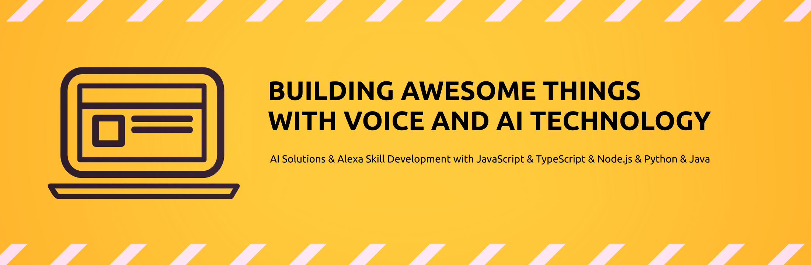

## About me

Freelance Developer based in Munich, Germany. Building AI prototypes and automations with LLMs, n8n, and Node.js. Open source enthusiast. Two projects funded by the German Federal Ministry of Education and Research (BMBF).

25+ years at the intersection of language and technology — from Voice Interfaces and Alexa to Large Language Models and AI Automation.

→ [LinkedIn](https://www.linkedin.com/in/frankboerncke/) · [Blog](https://boerncke.de/alexa/index.html) · [Homepage](https://boerncke.de/) · [YouTube](https://www.youtube.com/channel/UCkoQ_GsodRPhExe3fXENT4w) · [APL Ninja](https://apl.ninja/FrankBoerncke)

## Featured Projects

| Project | Description | Links |
|---------|-------------|-------|
| **Wunderprompt** | AI-curated news — less noise, more signal. Built with n8n, LLMs and Node.js. | [wunderprompt.com](https://wunderprompt.com) |
| **Private Prompts** | Privacy-first AI usage. Desktop app for local data masking. Funded by BMBF. Featured in DLF, PC Welt, golem.de, SZ. | [privateprompts.org](https://www.privateprompts.org) · [GitHub](https://github.com/fboerncke/private-prompts-prototype) |
| **Voice-QL** | Explore databases by voice — accessible, no SQL needed. Funded by BMBF. | [GitHub](https://github.com/fboerncke/voice-ql) |
| **Meine Mediathek** | Browse media libraries from public TV stations via voice. | [GitHub](https://meinemediathek.de) |

## Alexa Skills (selected)

| Skill | Description | Store |
|-------|-------------|-------|
| **Schlauberger** | Natural language interface for GPT on Alexa | [🇩🇪](https://www.amazon.de/dp/B0C2VNVGLZ) |
| **Mein Dashboard** | Widget-style dashboard for Echo Show devices | [🇩🇪](https://www.amazon.de/gp/product/B09R9TW9S8) [🇺🇸](https://www.amazon.com/gp/product/B09R9TW9S8) [🇬🇧](https://www.amazon.co.uk/gp/product/B09R9TW9S8) |
| **ToolBox** | Command line interface for Alexa Skill developers | [🇩🇪](https://www.amazon.de/gp/product/B091L5WB5S) [🇺🇸](https://www.amazon.com/gp/product/B091L5WB5S) [🇬🇧](https://www.amazon.co.uk/gp/product/B091L5WB5S) |
| **Universallexikon** | Context-aware Wikipedia skill with intelligent keyword matching | [🇩🇪](https://www.amazon.de/gp/product/B07166W6VL) [🇺🇸](https://www.amazon.com/gp/product/B07166W6VL) [🇬🇧](https://www.amazon.co.uk/gp/product/B07166W6VL) |
| **Kurznachricht** | Voice-to-email: speak a message, get it as email | [🇩🇪](https://www.amazon.de/gp/product/B0CCSJHHX7) |
| **Commander Speedo** | Voice-controlled shoot-em-up arcade game on Echo Show | [🇩🇪](https://www.amazon.de/gp/product/B08BFCTDC7) [🇺🇸](https://www.amazon.com/gp/product/B08BFCTDC7) [🇬🇧](https://www.amazon.co.uk/gp/product/B08BFCTDC7) |
| **APL Doctor** | Device-specific viewport diagnostics for APL developers | [🇩🇪](https://www.amazon.de/gp/product/B08BZ9NLCH) [🇺🇸](https://www.amazon.com/gp/product/B08BZ9NLCH) [🇬🇧](https://www.amazon.co.uk/gp/product/B08BZ9NLCH) |
| **Cinema Space** | Browse and watch NASA video archive by voice | [🇺🇸](https://www.amazon.com/gp/product/B094NMZW3M) [🇬🇧](https://www.amazon.co.uk/gp/product/B094NMZW3M) |
| **R2D2** | Astromech translator for fun | [🇩🇪](https://www.amazon.de/gp/product/B06XYQHPM9) [🇺🇸](https://www.amazon.com/gp/product/B06XYQHPM9) [🇬🇧](https://www.amazon.co.uk/gp/product/B06XYQHPM9) |

→ [Full list of all published Alexa Skills on amazon.de](https://www.amazon.de/s?k=applicate&i=alexa-skills)

## Developer Tools & Plugins

| Tool | Description | Links |
|------|-------------|-------|
| **Voice Model Expression Language** | Expression language for compact Alexa voice model notation | [Web App](https://voicemodel.applicate.de) · [LinkedIn Article](https://www.linkedin.com/pulse/adding-expression-language-alexa-voice-models-frank-b%25C3%25B6rncke/) |
| **Magic Prototyper** | Jovo V4 build hook for rapid voice app prototyping | [GitHub](https://github.com/fboerncke/jovo-v4-community-hook-magic-prototyper) |
| **Magic Model** | Jovo V4 build hook — Spintax & Jexl support for voice models | [GitHub](https://github.com/fboerncke/jovo-v4-community-hook-magic-model) |
| **Model Linter** | Jovo V4 build hook — linting for voice model files | [GitHub](https://github.com/fboerncke/jovo-v4-community-hook-model-linter) |
| **Spintax Plugin** | Jovo V4 output plugin for natural-sounding dialogue variation | [npm](https://www.npmjs.com/package/jovo-v4-community-plugin-spintax-output) · [GitHub](https://github.com/fboerncke/jovo-v4-community-plugin-spintax-output) |
| **Jexl Plugin** | Jovo V4 output plugin for expression language in responses | [npm](https://www.npmjs.com/package/jovo-v4-community-plugin-jexl-output) · [GitHub](https://github.com/fboerncke/jovo-v4-community-plugin-jexl-output) |
| **APL Grid Generator** | Generate APL container grid layouts | [Web App](https://aplgrid.applicate.de) |
| **JSON Formatter** | Online JSON pretty printer | [Web App](https://jsonformatter.applicate.de) |
| **Spintax Exploder** | Expand Spintax expressions to all permutations | [Web App](https://spintax.applicate.de) |

## Technologies, Languages & Tools

&nbsp;

&nbsp;

