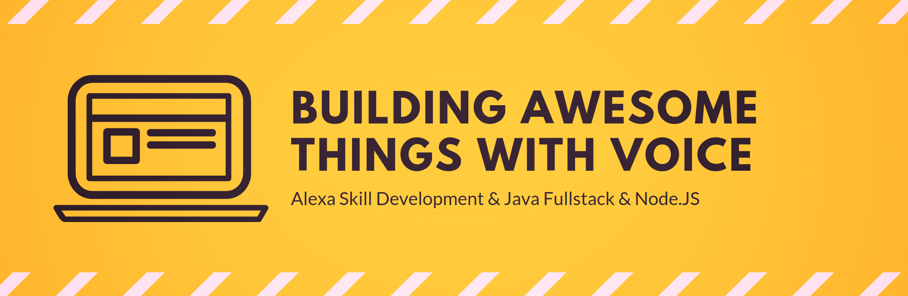

## About me

My name is Frank Börncke. I am a freelancer, located in the Munich area of Germany. 

Visit me on [Twitter](https://twitter.com/frank_boerncke), [LinkedIn](https://www.linkedin.com/in/frankboerncke/), [XING](https://www.xing.com/profile/Frank_Boerncke/cv), [YouTube](https://www.youtube.com/channel/UCkoQ_GsodRPhExe3fXENT4w), check my contributions to [ALP Ninja](https://apl.ninja/FrankBoerncke) or have a closer look at my [Blog](https://applicate.de/alexa/index.html)  on [my Homepage](https://applicate.de/).

## Favourite Technologies, Languages & Tools

&nbsp;
 
 
 
 
 
 
 
 
 
 
 
 
 
 
 
 
 
 
 
 
 
 
&nbsp;

## GitHub Repository Analysis

<!--

view rawmarkdown_icon hosted with ❤ by GitHub
-->

